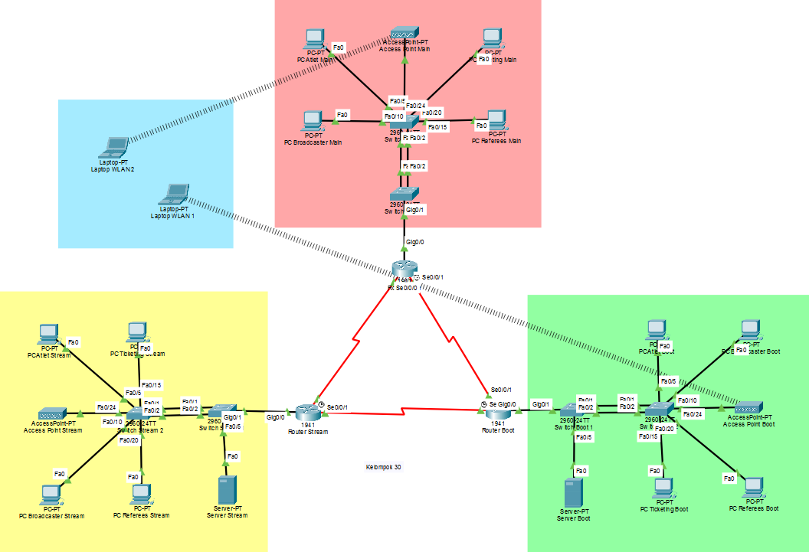
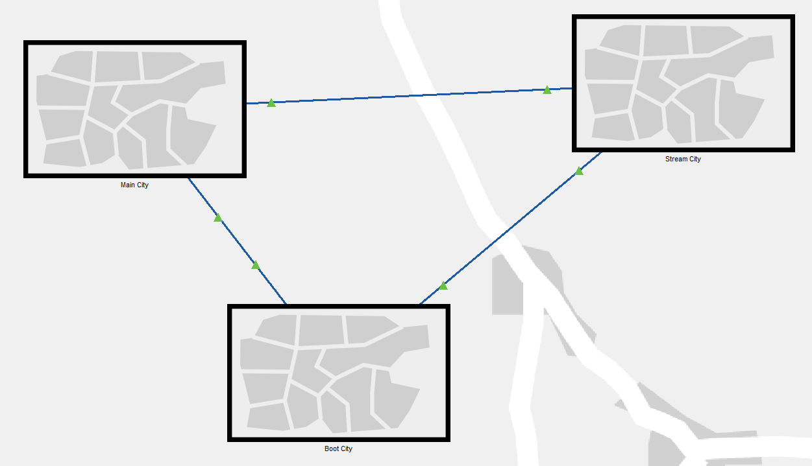
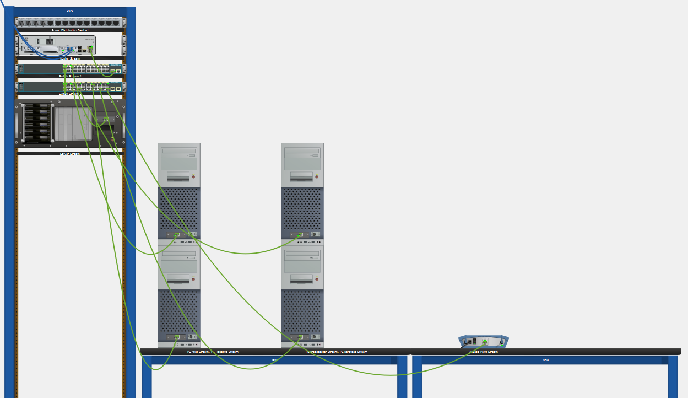

# Laporan Praktikum Jaringan Komputer 2025
## Studi Kasus: Mamak Punya Liga (MPL) — Soal Tipe 3 (Kelompok 30)

Repository ini berisi rancangan dan dokumentasi lengkap infrastruktur jaringan berskala besar untuk venue turnamen E-Sports "Mamak Punya Liga (MPL)". Jaringan dirancang untuk membagi beban kerja secara dinamis dan aman ke dalam 3 zona utama: Main Stage Arena, Streaming Studio, dan Bootcamp Area.

---

## Nama Kelompok 30 (Kelas Jaringan Komputer)

| Nama Anggota | NPM | Peran |
| :--- | :--- | :--- |
| **Marshal Aufa Diliyana** | 2406346913 | Lead Network Engineer |
| **Muhamad Rifqi Fadil Itsnain** | 2406355306 | Network Architect |
| **Yusri Sukur** | 2406345305 | Security & System Engineer |

---

## Struktur Folder & Repositori

```text
mamak-punya-liga/
├── assets/
│   └── images/
│       ├── Logical_Topology.png
│       ├── Physical_Topology_City.png
│       └── Physical_Topology_Rack.png
├── docs/
│   └── Laporan_Proyek_Kelompok_30.pdf
├── topology/
│   └── Topologi_Jaringan_Kelompok_30.pkt
└── README.md (Root - Berkas Dokumentasi Utama Premium)
```

---

## BAB 1: ANALISIS KEBUTUHAN & PERENCANAAN SUBNETTING

### 1.1 Deskripsi Masalah
Sebagai Chief Network Engineer untuk turnamen E-Sports "Mamak Punya Liga (MPL)", kami diminta merancang infrastruktur jaringan untuk venue besar yang terbagi menjadi 3 zona utama: Main Stage Arena, Streaming Studio, dan Bootcamp Area.

Tantangan utama dalam perancangan ini meliputi pemenuhan spesifikasi teknis berikut:
1. **Segmentasi Jaringan:** Setiap role (Referees, Ticketing, Broadcasters, Atlet) harus memiliki VLAN masing-masing.
2. **Konektivitas:** Seluruh zona harus saling terhubung (Inter-Zone Routing) dan antar role dapat berkomunikasi (Inter-VLAN Routing).
3. **Performansi:** Jaringan harus memiliki bandwidth cepat (implementasi EtherChannel) dan bebas dari looping (implementasi Spanning Tree Protocol).
4. **Keamanan & Limitasi:** Membatasi jumlah perangkat yang terhubung sesuai dengan jumlah host yang dialokasikan.
5. **Layanan Terpusat:** Web Server ditempatkan di Streaming Studio, sedangkan DNS & Email Server terpusat di Bootcamp Area.

### 1.2 Perhitungan Host (Kelompok 30)
Berdasarkan Nomor Kelompok X = 30, berikut adalah rincian perhitungan kebutuhan host untuk setiap role di masing-masing zona:

#### A. Main Stage Arena
* **Referees:** (15 * 30) / 5 = 90 Host
* **Ticketing:** (144 * 30) / 12 = 360 Host
* **Broadcasters:** (30 * 30) / 2 = 450 Host
* **Atlet:** 30 * 30 = 900 Host (Kebutuhan Terbesar)

#### B. Streaming Studio
* **Referees:** 2 * 30 = 60 Host
* **Ticketing:** (27 * 30) / 9 = 90 Host
* **Broadcasters:** 2 * (30 + 25) = 110 Host
* **Atlet:** 2 * (30 + 15) = 90 Host

#### C. Bootcamp Area
* **Referees:** 30 + 5 = 35 Host
* **Ticketing:** 2 * 30 = 60 Host
* **Broadcasters:** (2 * 30) + 66 = 126 Host
* **Atlet:** ((4 * 30) / 20) * 25 = 150 Host

---

### 1.3 Tabel Subnetting VLSM
Alokasi IP Address menggunakan IP Base 10.30.0.0/16 dengan metode VLSM (Variable Length Subnet Mask) untuk menghemat ruang alamat IP. Tabel diurutkan dari kebutuhan host terbesar ke terkecil untuk menghindari overlapping IP.

| Zona | VLAN ID | Role | Host | Subnet | Network Address | Usable IP Range | Broadcast Address |
| :--- | :---: | :--- | :---: | :---: | :--- | :--- | :--- |
| **Main** | 10 | Atlet | 900 | `/22` | `10.30.0.0` | `10.30.0.2` - `10.30.3.254` | `10.30.3.255` |
| | 20 | Broadcasters | 450 | `/23` | `10.30.4.0` | `10.30.4.2` - `10.30.5.254` | `10.30.5.255` |
| | 30 | Ticketing | 360 | `/23` | `10.30.6.0` | `10.30.6.2` - `10.30.7.254` | `10.30.7.255` |
| | 40 | Referees | 90 | `/25` | `10.30.8.0` | `10.30.8.2` - `10.30.8.126` | `10.30.8.127` |
| | 99 | WLAN (Bonus) | 250 | `/24` | `10.30.9.0` | `10.30.9.2` - `10.30.9.254` | `10.30.9.255` |
| **Stream**| 20 | Broadcasters | 110 | `/25` | `10.30.10.0` | `10.30.10.2` - `10.30.10.126` | `10.30.10.127` |
| | 30 | Ticketing | 90 | `/25` | `10.30.10.128` | `10.30.10.130` - `10.30.10.254` | `10.30.10.255` |
| | 10 | Atlet | 90 | `/25` | `10.30.11.0` | `10.30.11.2` - `10.30.11.126` | `10.30.11.127` |
| | 40 | Referees | 60 | `/26` | `10.30.11.128` | `10.30.11.130` - `10.30.11.190` | `10.30.11.191` |
| | 50 | Web Server (Static) | 1 | `/27` | `10.30.11.192` | `10.30.11.194` - `10.30.11.222` | `10.30.11.223` |
| | 99 | WLAN (Bonus) | 250 | `/24` | `10.30.12.0` | `10.30.12.2` - `10.30.12.254` | `10.30.12.255` |
| **Boot** | 10 | Atlet | 150 | `/24` | `10.30.13.0` | `10.30.13.2` - `10.30.13.254` | `10.30.13.255` |
| | 20 | Broadcasters | 126 | `/24` | `10.30.14.0` | `10.30.14.2` - `10.30.14.254` | `10.30.14.255` |
| | 30 | Ticketing | 60 | `/26` | `10.30.15.0` | `10.30.15.2` - `10.30.15.62` | `10.30.15.63` |
| | 40 | Referees | 35 | `/26` | `10.30.15.64` | `10.30.15.66` - `10.30.15.126` | `10.30.15.127` |
| | 50 | Main Server (Static) | 1 | `/27` | `10.30.15.128` | `10.30.15.130` - `10.30.15.158` | `10.30.15.159` |
| | 99 | WLAN (Bonus) | 250 | `/24` | `10.30.16.0` | `10.30.16.2` - `10.30.16.254` | `10.30.16.255` |

*Catatan: Gateway di setiap sub-jaringan/VLAN dialokasikan pada IP .1 (misalnya, gateway untuk VLAN 10 Main Stage adalah 10.30.0.1).*

---

## BAB 2: DESAIN TOPOLOGI

Perancangan jaringan menggunakan pendekatan Hierarchical Network Design sederhana yang terdiri dari 3 lapisan utama untuk menjamin skalabilitas dan kemudahan manajemen:

### 2.1 Topologi Logical
* **Core Layer (Router Backbone):** Menggunakan 3 unit Router Cisco 1941 yang saling terhubung membentuk topologi Full Mesh (Segitiga). Koneksi antar router menggunakan kabel Serial untuk mensimulasikan koneksi jarak jauh (WAN) dan menyediakan redundansi jalur. Jika satu jalur putus, routing protokol RIPv2 akan otomatis mengalihkan lalu lintas ke jalur lain.
* **Distribution Layer:** Menggunakan Switch Cisco 2960 di setiap zona yang berfungsi sebagai uplink ke Router dan penghubung ke Server Farm (Web/DHCP/DNS).
* **Access Layer:** Menggunakan Switch Cisco 2960 yang terhubung langsung ke perangkat pengguna (End Devices) seperti PC, Laptop, dan Access Point. Pemisahan switch ini bertujuan untuk membagi beban trafik.
* **Fitur Redundansi & Bandwidth:** Antara Switch Distribution dan Switch Access dihubungkan menggunakan teknologi EtherChannel (LACP). Konfigurasi ini menggabungkan 2 kabel fisik menjadi 1 link logis, yang berfungsi untuk meningkatkan kapasitas bandwidth antar-switch dan mencegah bottleneck trafik dari ratusan host.



### 2.2 Topologi Physical
Sesuai ketentuan untuk visualisasi keadaan sebenarnya, implementasi fisik dibagi menjadi 3 Kota (Cities) dan 4 Gedung (Buildings). Ini merepresentasikan bahwa ketiga zona tersebut berada di lokasi geografis yang terpisah namun tetap terhubung dalam satu jaringan WAN.

1. **Main_City (Zona Merah):**
   * Terdiri dari 2 Gedung: "Arena Panggung Utama" dan "Ruang Panitia".
   * Berisi Router Main, Switch Main, dan mayoritas host Atlet/Panitia.
2. **Stream_City (Zona Kuning):**
   * Terdiri dari 1 Gedung: "Studio Streaming".
   * Berisi Web Server dan perangkat Broadcaster.
3. **Boot_City (Zona Hijau):**
   * Terdiri dari 1 Gedung: "Mess Atlet & Server Room".
   * Berisi Server Pusat (DHCP/DNS/Email) yang diletakkan di Rack Server khusus.

#### Tampilan Geografis (Physical Cities & Buildings)


#### Tampilan Rak Perangkat (Rack Layout)


---

## BAB 3: IMPLEMENTASI DAN KONFIGURASI

Bab ini menjelaskan detail konfigurasi CLI (Command Line Interface) yang diterapkan pada perangkat. Konfigurasi dikelompokkan berdasarkan fungsi dan fiturnya.

### 3.1 Konfigurasi Router (Layer 3)
Konfigurasi router difokuskan pada tiga fungsi utama: koneksi WAN, Gateway VLAN, dan Routing Dinamis.

#### A. Konfigurasi Interface Serial (Koneksi WAN)
Digunakan untuk menghubungkan router dengan router lain di zona berbeda.

| Command (Perintah CLI) | Penjelasan & Alasan |
| :--- | :--- |
| `interface <interface-id>` | Masuk ke antarmuka Serial (e.g. `Serial0/0/0`). |
| `ip address <ip> <subnet>` | Memberikan IP Address dengan subnet mask `/30`. Subnet `/30` dipilih karena koneksi antar-router bersifat Point-to-Point (hanya butuh 2 IP usable), sehingga sangat efisien. |
| `no shutdown` | Mengaktifkan antarmuka agar status link menjadi UP. |

*Konfigurasi ini diterapkan pada:* Router Main, Router Streaming, dan Router Bootcamp.

#### B. Konfigurasi Inter-VLAN & DHCP Relay (Router-on-a-Stick)
Digunakan agar router bisa menjadi gateway bagi banyak VLAN sekaligus dan meneruskan permintaan IP ke server pusat.

| Command (Perintah CLI) | Penjelasan & Alasan |
| :--- | :--- |
| `interface <port>.<vlan-id>` | Membuat sub-interface logis untuk VLAN pada port fisik (e.g. `GigabitEthernet0/0.10`). |
| `encapsulation dot1Q <vlan-id>` | Mengaktifkan protokol 802.1Q agar router bisa membaca tag VLAN dari switch. |
| `ip address <ip> <subnet>` | Menetapkan IP Gateway untuk VLAN sesuai dengan tabel subnetting VLSM. |
| `ip helper-address <ip-dhcp-server>` | DHCP Relay Agent. Perintah krusial ini berfungsi meneruskan (relay) pesan broadcast "minta IP DHCP" dari PC Client ke IP Server DHCP yang berada di zona Bootcamp. Tanpa ini, client di zona luar tidak akan mendapatkan IP dinamis. |

*Konfigurasi ini diterapkan pada:* Router Main, Router Streaming, dan Router Bootcamp.

#### C. Konfigurasi Routing Dinamis (RIPv2)
Digunakan untuk pertukaran rute otomatis antar ketiga zona secara dinamis.

| Command (Perintah CLI) | Penjelasan & Alasan |
| :--- | :--- |
| `router rip` | Mengaktifkan protokol routing RIP pada router. |
| `version 2` | Menggunakan RIP versi 2 yang mendukung classless routing dan VLSM (Variable Length Subnet Mask). |
| `no auto-summary` | Wajib diaktifkan. Mencegah router menggabungkan subnet-subnet kecil (`/22`, `/23`) menjadi satu network besar default kelas A/B/C (`/8` atau `/16`), yang bisa menyebabkan konflik rute. |
| `network 10.0.0.0` | Mendaftarkan network utama `10.x.x.x` agar dapat dikenali dan dipromosikan oleh router tetangga. |

*Konfigurasi ini diterapkan pada:* Router Main, Router Streaming, dan Router Bootcamp.

---

### 3.2 Konfigurasi Switch (Layer 2)
Konfigurasi switch dibagi menjadi manajemen VLAN, optimasi bandwidth, dan keamanan.

#### A. Konfigurasi Database VLAN
Langkah awal untuk memisahkan trafik broadcast antar divisi/role.

| Command (Perintah CLI) | Penjelasan & Alasan |
| :--- | :--- |
| `vlan <vlan-id>` | Membuat VLAN baru dengan ID tertentu (misalnya, `vlan 10`). |
| `name <nama-vlan>` | Memberikan nama identitas yang deskriptif. Hal ini mempermudah administrator jaringan dalam manajemen dan troubleshoot. |

*Konfigurasi ini diterapkan pada:* Switch Main 1 & 2, Switch Stream 1 & 2, dan Switch Boot 1 & 2.

#### B. Konfigurasi Spanning Tree Protocol (STP)
Untuk mencegah looping pada topologi redundan yang memiliki jalur kabel ganda.

| Command (Perintah CLI) | Penjelasan & Alasan |
| :--- | :--- |
| `spanning-tree mode rapid-pvst` | Mengaktifkan mode Rapid-PVST (Per-VLAN Spanning Tree). Mode ini dipilih karena memiliki waktu konvergensi (pemulihan) yang jauh lebih cepat dibanding STP standar jika terjadi perubahan topologi atau kabel putus. |

*Konfigurasi ini diterapkan pada:* Switch Main 1 & 2, Switch Stream 1 & 2, dan Switch Boot 1 & 2.

#### C. Konfigurasi EtherChannel (LACP)
Menggabungkan dua kabel fisik menjadi satu jalur logis untuk efisiensi bandwidth.

| Command (Perintah CLI) | Penjelasan & Alasan |
| :--- | :--- |
| `interface range <port1 - port2>` | Memilih rentang interface fisik sekaligus yang terhubung ke switch tetangga. |
| `channel-group 1 mode active` | Mengaktifkan protokol LACP (Link Aggregation Control Protocol) secara aktif untuk bernegosiasi membentuk EtherChannel. |
| `interface port-channel 1` | Masuk ke antarmuka logis hasil penggabungan untuk dikonfigurasi lebih lanjut. |
| `switchport mode trunk` | Mengonfigurasi port agar bekerja pada mode Trunk agar dapat melewatkan trafik dari banyak VLAN sekaligus (Tagged). |

*Konfigurasi ini diterapkan pada:* Switch Main 1 & 2, Switch Stream 1 & 2, dan Switch Boot 1 & 2.

#### D. Konfigurasi Port Trunk & Access
Mengatur jalur lalu lintas data pada port switch.

| Command (Perintah CLI) | Penjelasan & Alasan |
| :--- | :--- |
| `switchport mode trunk` | Dikonfigurasi pada port yang mengarah ke Router dan Switch lain agar mengizinkan port membawa trafik dari banyak VLAN (Tagged). |
| `switchport mode access` | Dikonfigurasi pada port yang mengarah ke PC/Laptop (End Devices). Hanya mengizinkan satu VLAN spesifik. |
| `switchport access vlan <id>` | Memasukkan port access tersebut secara spesifik ke anggota VLAN yang bersesuaian. |
| `spanning-tree portfast` | Fitur optimasi pada port Access. Melewati status Listening/Learning STP agar port langsung aktif (Forwarding) saat kabel dicolok, sehingga mempercepat proses PC mendapatkan IP dari DHCP. |

*Konfigurasi ini diterapkan pada:* Switch Main 2, Switch Stream 1 & 2, dan Switch Boot 1 & 2.

---

### 3.3 Konfigurasi Server (Layanan Terpusat)
Konfigurasi dilakukan melalui antarmuka GUI (Graphical User Interface) pada Server Bootcamp dan Server Streaming:

1. **DHCP Server (Pusat):**
   * Dibuat 15 DHCP Pool terpisah untuk melayani setiap VLAN di 3 zona berbeda secara otomatis.
   * Parameter Default Gateway pada setiap pool disesuaikan dengan IP Router (sub-interface) di zona masing-masing.
   * Parameter DNS Server diarahkan ke IP DNS Pusat yaitu `10.30.15.130`.
2. **DNS Server:**
   * Diaktifkan di Bootcamp Area. Dibuat record berupa A Record untuk domain `www.mpl-mamak.com` yang dipetakan ke IP Web Server static `10.30.11.194`.
3. **Web Server:**
   * Ditempatkan di Streaming Studio. Mengaktifkan layanan HTTP/HTTPS dan menyunting file `index.html` sebagai halaman portal turnamen MPL.
4. **Access Point (WLAN):**
   * Mengaktifkan layanan implementasi fitur tambahan WLAN (SSID dan Enkripsi) di setiap zona untuk melayani user nirkabel.

---

## BAB 4: DOKUMENTASI DAN PENGUJIAN

Bab ini melampirkan hasil pengujian konektivitas untuk memvalidasi bahwa seluruh sistem jaringan bekerja dengan baik sesuai spesifikasi.

### 4.1 Pengujian Konektivitas (Ping & Web)
Pengujian dilakukan menggunakan perintah ping dan Web Browser pada PC Client.

#### Skenario 1: Pengujian Inter-VLAN Routing
* **Aktivitas:** Melakukan ping dari PC Atlet (VLAN 10) di Main Stage ke PC Ticketing (VLAN 30) di Main Stage.
* **Hasil:** Reply from 10.30.6.2: bytes=32 time<1ms TTL=127 / Successful.
* **Analisis:** Membuktikan bahwa fitur Router-on-a-Stick pada router berhasil melakukan routing antar sub-interface VLAN yang berbeda di zona yang sama.

#### Skenario 2: Pengujian Inter-Zone Routing (WAN)
* **Aktivitas:** Melakukan ping dari PC Atlet (VLAN 10 - Zona Merah) ke Web Server (VLAN 50 - Zona Kuning).
* **Hasil:** Reply from 10.30.11.194: bytes=32 time<1ms TTL=126 / Successful.
* **Analisis:** Membuktikan protokol routing dinamis RIPv2 berhasil menukar rute informasi dan menghubungkan zona yang terpisah secara geografis melalui link WAN Serial.

#### Skenario 3: Pengujian Web Server & DNS
* **Aktivitas:** Mengakses nama domain `www.mpl-mamak.com` melalui Web Browser pada PC Client di zona mana saja.
* **Hasil:** Halaman web portal turnamen MPL berhasil ditampilkan secara utuh.
* **Analisis:** Membuktikan DNS Server sukses memetakan domain ke IP Address tujuan dan Web Server berfungsi menerima request HTTP dengan baik.

### 4.2 Pengujian Wireless LAN (Bonus +10)
* **Aktivitas:** Menghubungkan perangkat Smartphone ke SSID `MPL_WIFI_ZONE_1` menggunakan password WPA2-PSK yang telah ditentukan.
* **Hasil:** Smartphone berhasil terkoneksi, mendapatkan alamat IP dinamis dari VLAN 99 (DHCP), dan sukses melakukan ping ke Default Gateway.

---

## BAB 5: KESIMPULAN

Berdasarkan perancangan, implementasi, dan pengujian yang telah dilakukan untuk studi kasus infrastruktur jaringan MPL Kelompok 30, dapat ditarik kesimpulan sebagai berikut:

1. **Efisiensi Pengalamatan IP:** Penggunaan metode VLSM dengan IP Base `10.30.0.0/16` berhasil mengakomodasi kebutuhan host yang masif (termasuk 900 host Atlet) secara presisi tanpa ada pemborosan ruang alamat IP.
2. **Kehandalan Jaringan (Redundansi):** Topologi Mesh Segitiga pada Core Layer memberikan redundansi rute. Jaringan terbukti tetap hidup (high availability) meskipun salah satu link WAN antar-router sengaja diputus karena RIPv2 langsung mengalihkan rute secara otomatis.
3. **Optimasi Bandwidth & Beban:** Implementasi EtherChannel (LACP) pada Distribution Layer terbukti efektif menggandakan kapasitas bandwidth antar-switch serta mencegah bottleneck saat trafik pertandingan sangat padat.
4. **Manajemen Terpusat:** Penggunaan DHCP Relay (`ip helper-address`) sukses memusatkan manajemen distribusi IP Address hanya di satu zona (Bootcamp), sehingga menyederhanakan proses administrasi dan monitoring jaringan.
5. **Pemenuhan Syarat Proyek:** Seluruh persyaratan teknis dalam soal tipe 3, termasuk segmentasi VLAN, keamanan Port Security, visualisasi Physical Mode (skala Kota dan Rak), hingga bonus implementasi WLAN, telah berhasil dipenuhi dan divalidasi fungsinya dengan hasil sukses.

Sistem jaringan ini dinyatakan siap untuk diimplementasikan pada event turnamen Mamak Punya Liga (MPL) guna mendukung kelancaran seluruh aktivitas pertandingan!